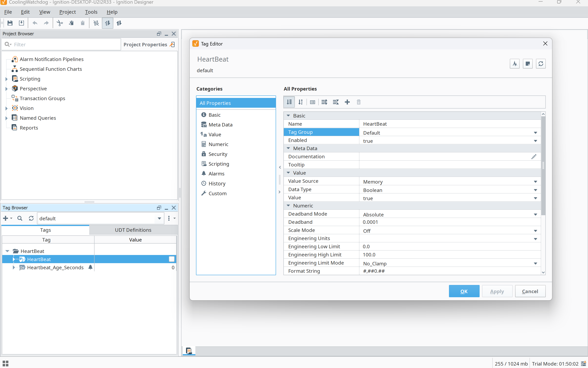
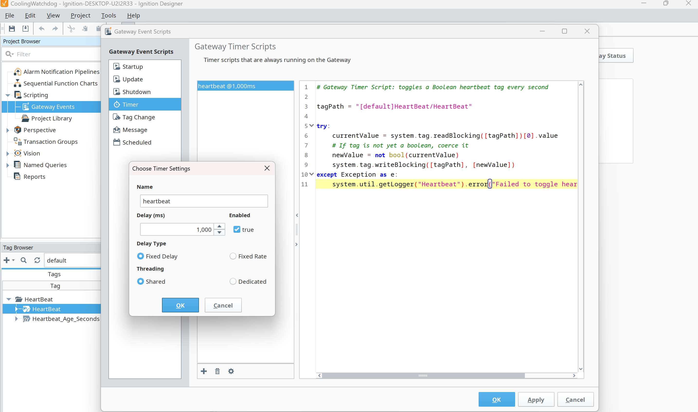
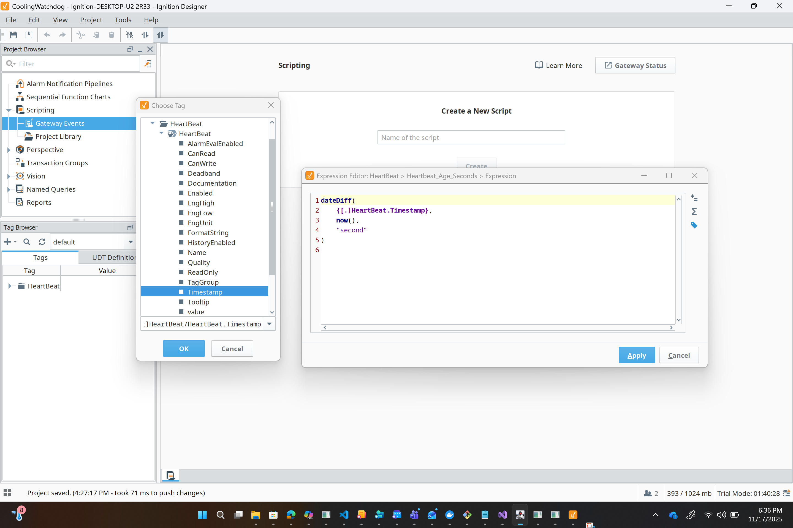
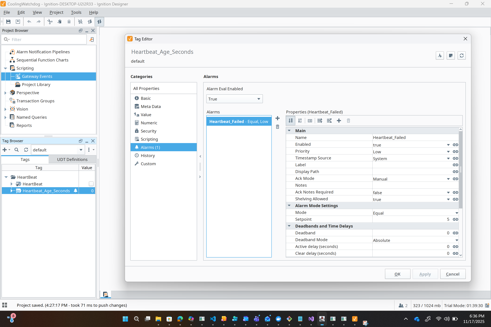
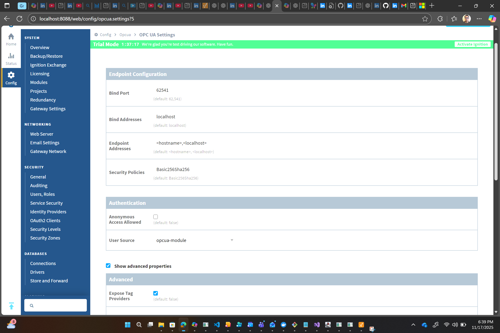
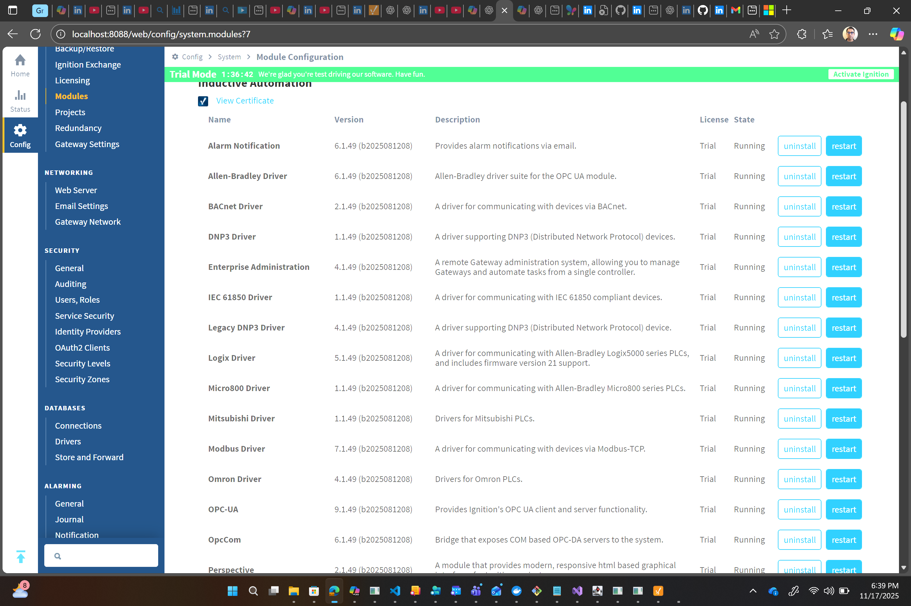
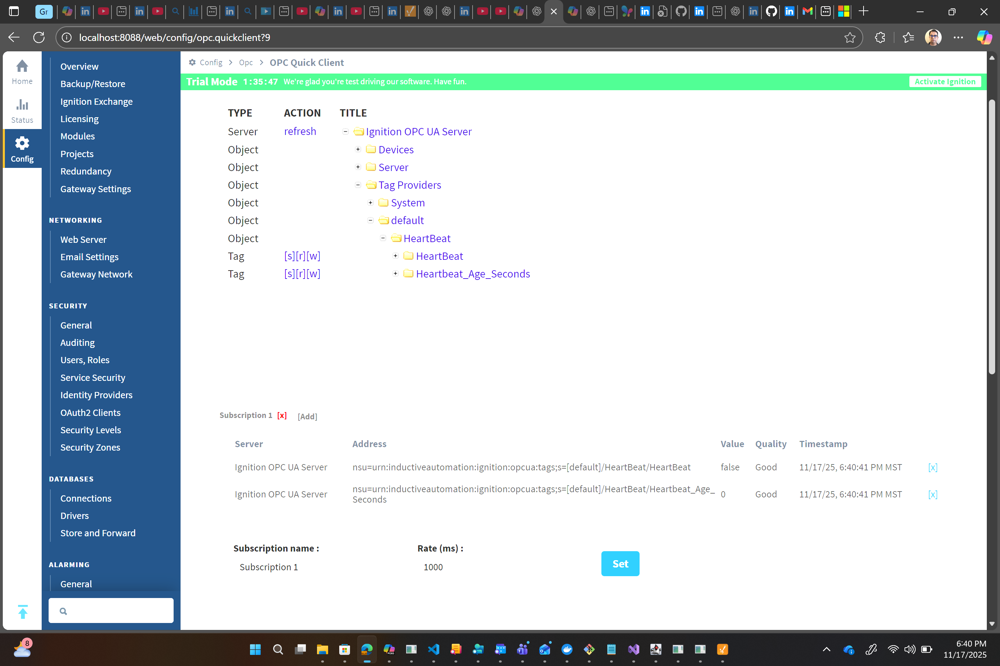

# 🚦 Ignition Heartbeat Monitor (C# + OPC UA)
### *(Work in Progress — More Sections Coming Soon)*

This repository contains a **C# application** designed to monitor the operational health of an **Ignition SCADA Gateway** using **OPC UA heartbeat signals**.

It continuously evaluates two key tags exposed through Ignition:

- `HeartBeat` – a boolean tag toggled every second  
- `Heartbeat_Age_Seconds` – expression tag showing how long since the last toggle  

The C# application subscribes to these values, evaluates their state, transforms the data, and publishes the result to configurable output channels such as Console or Azure HTTP endpoints.

---

# 📁 Project Structure

```
IgnitionHeartbeatMonitor/
│
├── config/
│     ├── apps.json
│     └── apps.json.md
│
├── Ignition/
│     ├── HeartBeatTag.png
│     ├── HeartBeatTag1.png
│     ├── HeartBeatTag2.png
│     ├── HeartBeatTag3.png
│     ├── HeartBeatTag4.png
│     ├── HeartBeatTag5.png
│     └── HeartBeatTag6.png
│
├── src/
│     └── Pipeline/
│           └── HeartBeatContracts.cs
│
├── Program.cs
└── Readme.md
```

---

# 🧩 Solution Overview

The solution consists of **three coordinated layers**:

1. **Ignition Heartbeat Generation** (tags, scripts, alarms)  
2. **OPC UA Exposure** (Expose Tag Providers, NodeId access)  
3. **C# Heartbeat Monitoring Pipeline** (reader → validator → transformer → publisher)

---

# 🔧 Heartbeat Pipeline Architecture

This project uses a clean, modular pipeline pattern.

```
┌────────────┐      ┌──────────────┐      ┌───────────────┐      ┌──────────────┐
│  ITagReader│  →   │  IValidator  │  →   │ ITransformer   │  →   │  IPublisher   │
└────────────┘      └──────────────┘      └───────────────┘      └──────────────┘
     │                    │                      │                       │
Reads OPC UA tags   Applies heartbeat      Creates a normalized     Publishes event to
(subscription/poll)   rules for timing       HeartbeatEvent          Console, HTTP, Azure
                     and quality state
```

### 📌 Summary of Each Stage

| Component | Description |
|----------|-------------|
| **ITagReader** | Streams tag updates using OPC UA subscriptions (or polling fallback). |
| **IValidator** | Applies timing and quality rules → determines Ok / Late / Stalled / BadQuality. |
| **ITransformer** | Converts raw values + state into `HeartbeatEvent`. |
| **IPublisher** | Sends events to destinations: Console, HTTP, Azure Function, etc. |
| **Domain DTOs** | `TagValue<T>`, `HeartbeatEvent`, `HeartbeatState`. |

---

# 🔹 1. Heartbeat Generation in Ignition

This section documents how the Ignition Gateway produces a reliable heartbeat.

---

## **1.1 Create the HeartBeat Tag**



Create a boolean memory tag at:

```
[default]HeartBeat/HeartBeat
```

---

## **1.2 Gateway Timer Script**



Script toggles the heartbeat every 1000 ms:

```python
tagPath = "[default]HeartBeat/HeartBeat"

try:
    currentValue = system.tag.readBlocking([tagPath])[0].value
    newValue = not bool(currentValue)
    system.tag.writeBlocking([tagPath], [newValue])
except Exception as e:
    system.util.getLogger("Heartbeat").error("Toggle failed: %s" % e)
```

---

## **1.3 Create Heartbeat_Age_Seconds**



Expression:

```python
dateDiff(
    {[.]HeartBeat.Timestamp},
    now(),
    "second"
)
```

---

## **1.4 Configure Alarm**



Triggers when heartbeat stalls or becomes too old.

---

## **1.5 Enable OPC UA Provider Exposure**



Turn on:

```
Expose Tag Providers
```

---

## **1.6 Validate via OPC Quick Client**





---

# 🔹 2. OPC UA Exposure

Once exposure is enabled, tags are available as:

```
ns=1;s=[default]HeartBeat/HeartBeat
ns=1;s=[default]HeartBeat/Heartbeat_Age_Seconds
```

These are referenced in the application’s `apps.json`.

---

# 🔹 3. C# Monitoring Application

The C# application:

- Connects to Ignition OPC UA  
- Subscribes to heartbeat tag updates  
- Tracks heartbeat freshness  
- Validates update timing  
- Publishes events to chosen output channels  

Configuration-driven via **apps.json**.

---

# 📝 apps.json Configuration

Value found at:

```
config/apps.json
```

```json
{
  "OpcUa": {
    "EndpointUrl": "opc.tcp://localhost:62541/UA/IgnitionOPCUAServer",
    "SecurityMode": "None",
    "SecurityPolicy": "None",
    "Username": "",
    "Password": "",
    "NodeIds": {
      "Heartbeat": "ns=1;s=[default]HeartBeat/HeartBeat",
      "HeartbeatAgeSeconds": "ns=1;s=[default]HeartBeat/Heartbeat_Age_Seconds"
    },
    "Subscription": {
      "Enabled": true,
      "PublishingIntervalMs": 1000,
      "SamplingIntervalMs": 1000,
      "QueueSize": 2
    },
    "Polling": {
      "Enabled": false,
      "IntervalMs": 1000
    }
  },
  "HeartbeatRules": {
    "ExpectedPeriodMs": 1000,
    "LateThresholdMs": 3000,
    "StallThresholdMs": 10000
  },
  "Publisher": {
    "Kind": "Multi",
    "Targets": [
      { "Type": "Console" },
      {
        "Type": "Http",
        "EndpointUrl": "https://<your-azure-function-or-iothub-endpoint>",
        "AuthHeader": "Bearer <your-token-or-SAS-key>"
      }
    ]
  }
}
```

---

# 🧱 Domain Contracts

Detailed documentation:

📄 **`HeartBeatContracts.md`**

This file explains:

- `TagValue<T>`
- `HeartbeatEvent`
- `HeartbeatState`
- `ITagReader`
- `IValidator`
- `ITransformer`
- `IPublisher`

---

# 🚧 Work in Progress

Planned additions:

- OPC UA TagReader implementation  
- Validator implementation  
- Cloud publishing pipeline  
- Azure integration workflow  
- Full architecture diagram  
- Getting Started Guide  

---

