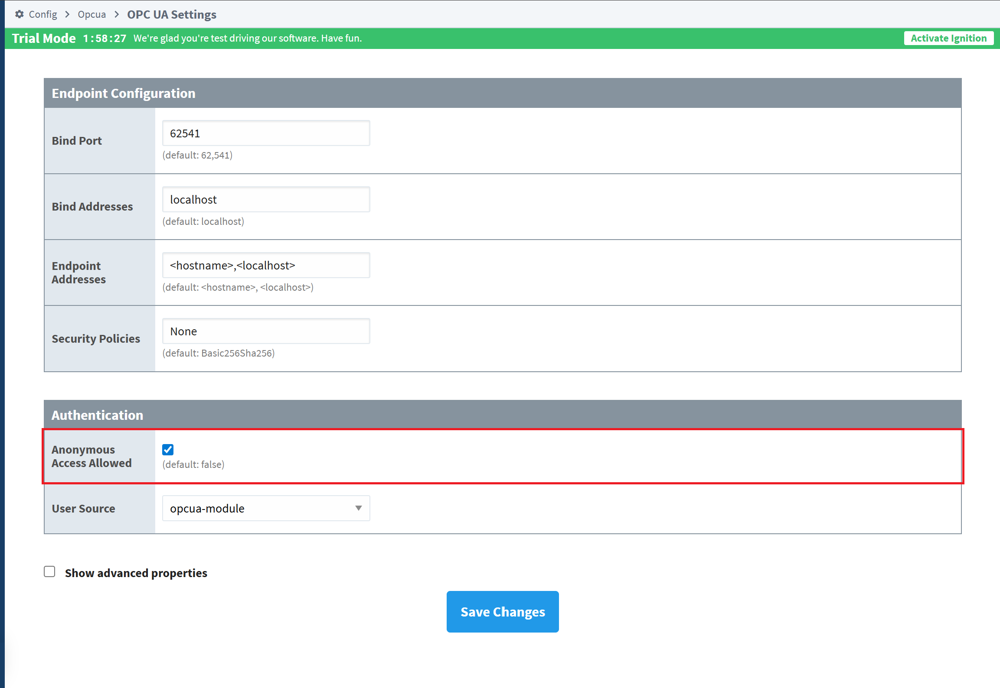
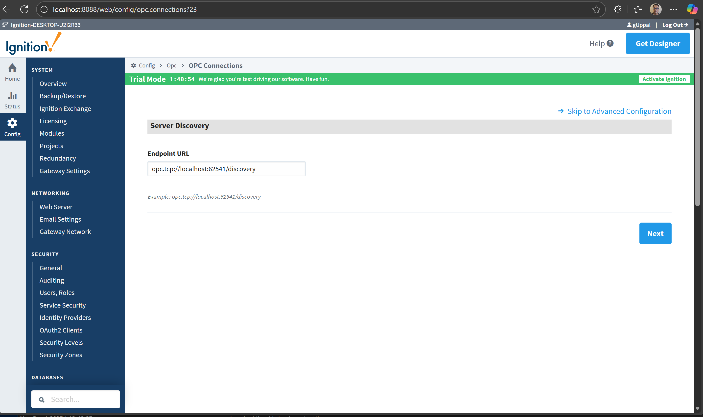
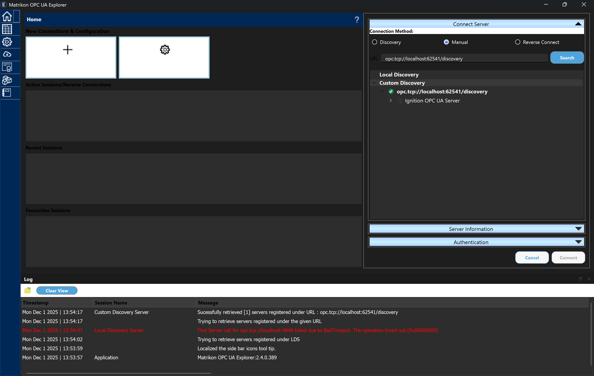
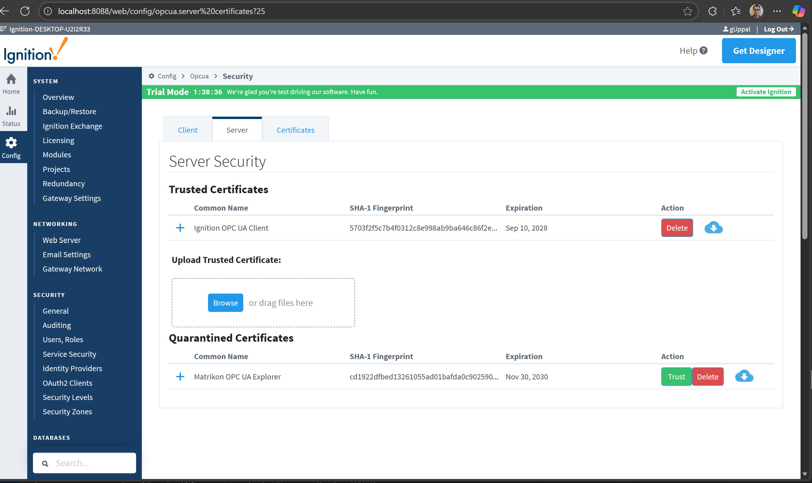
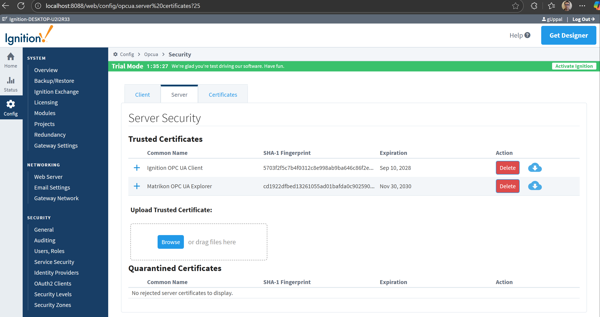
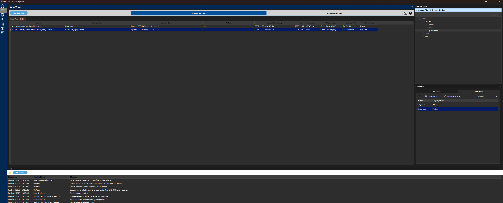

# 🔥 Ignition Heartbeat Monitor  
Updated README with **working screenshot links** and **working link to HeartBeatContracts.md**.

---

## 📁 Repository Structure

```
IgnitionHeartbeatMonitor/
├── Readme.md
├── SECURITY_CONFIG.md
├── .gitignore
├── .gitattributes
├── IgnitionHeartbeatMonitor.csproj
├── Program.cs
│
├── config/
│   ├── apps.json
│   └── apps.json.md
│
├── Ignition/
│   ├── HeartBeatTag.png
│   ├── HeartBeatTag1.png
│   ├── HeartBeatTag2.png
│   ├── HeartBeatTag3.png
│   ├── HeartBeatTag4.png
│   ├── HeartBeatTag5.png
│   ├── HeartBeatTag6.png
│   ├── HeartBeatTag7.png
│   ├── HeartBeatTag8.png
│   ├── HeartBeatTag9.png
│   ├── HeartBeatTag10.png
│   ├── HeartBeatTag11.png
│   └── HeartBeatTag12.png
│
├── src/
│   ├── Implementation/
│   │   └── opcUAReader.cs
│   │
│   └── PipeLine/
│       └── pki/
│           ├── issuers/
│           ├── own/
│           ├── rejected/
│           └── trusted/


```

---

## 🧩 Domain Contracts  
📄 Full documentation here:  
👉 **[HeartBeatContracts.md](src/PipeLine/HeartBeatContracts.md)**


This describes:

- `TagValue<T>`
- `HeartbeatState`
- `HeartbeatEvent`
- `ITagReader`
- `IValidator`
- `ITransformer`
- `IPublisher`

---

# ❤️ Heartbeat Generation in Ignition

## 1️⃣ Create HeartBeat tag  


---

## 2️⃣ Create Gateway Timer Script  


---

## 3️⃣ Create Heartbeat_Age_Seconds  


---

## 4️⃣ Add Alarm Configuration  


---

## 5️⃣ Expose Tag Providers (OPC UA Settings)  


---

## 6️⃣ Validate Tags via OPC Quick Client  


---

## 7️⃣ Allow Anonymous Access (for testing)


___

## 8️⃣ Test Connection with Matrikon OPC UA Explorer











# 🧪 apps.json Configuration

(This file drives OPC UA connection, rules, and publisher settings.)

```json
{
  "OpcUa": {
    "EndpointUrl": "opc.tcp://localhost:62541/discovery",
    "SecurityMode": "None",
    "SecurityPolicy": "None",
    "Username": "",
    "Password": "",
    "NodeIds": {
      "Heartbeat": "ns=1;s=[default]HeartBeat/HeartBeat",
      "HeartbeatAgeSeconds": "ns=1;s=[default]HeartBeat/Heartbeat_Age_Seconds"
    },
    "Subscription": {
      "Enabled": true,
      "PublishingIntervalMs": 1000,
      "SamplingIntervalMs": 1000,
      "QueueSize": 2
    },
    "Polling": {
      "Enabled": false,
      "IntervalMs": 1000
    }
  },
  "HeartbeatRules": {
    "ExpectedPeriodMs": 1000,
    "LateThresholdMs": 3000,
    "StallThresholdMs": 10000
  },
  "Publisher": {
    "Kind": "Multi",
    "Targets": [
      { "Type": "Console" },
      {
        "Type": "Http",
        "EndpointUrl": "https://<your-azure-function-or-iothub-endpoint>",
        "AuthHeader": "Bearer <your-token-or-SAS-key>"
      }
    ]
  }
}
```

---

# 🚧 Work In Progress  
More sections coming soon:

- OPC UA TagReader implementation  
- Validator logic  
- Event transformers  
- Azure publisher  
- Architecture diagrams  

